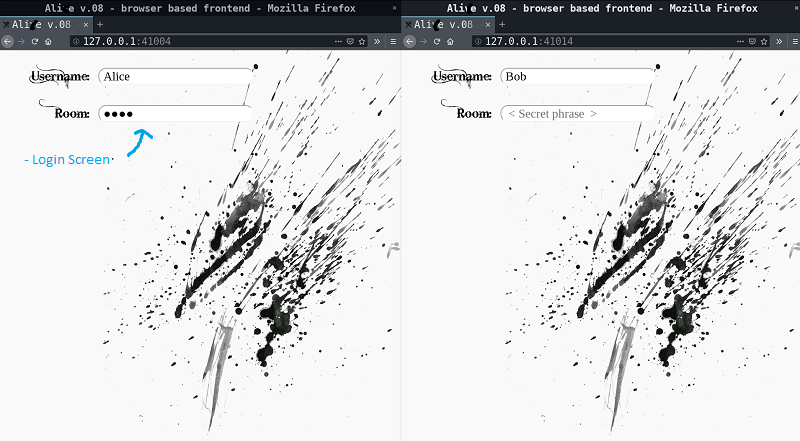
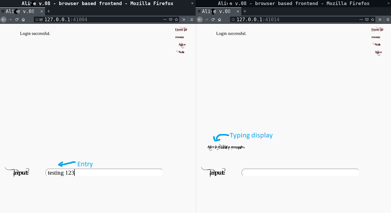
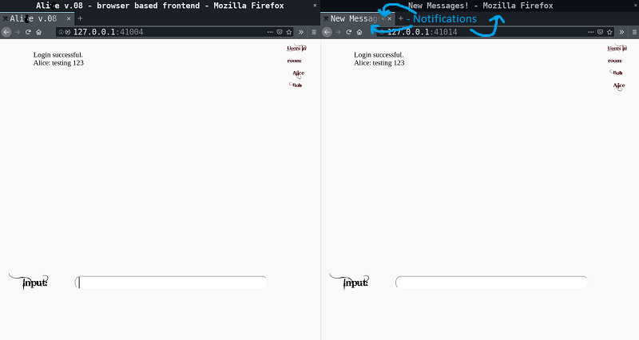

## TODO:
## Add game video demo

# ProjectDemo-FourthYear

# Alice v.08

This project is a chat client and server designed with the goal of \
leaking as little information as practical.\
\
This project has had many iterations. It ran the gamut from Discord self-botting with a\
javafx GUI, javascript/nodejs web deployments on AWS with whonix VM frontends, \
to openBSD-only iterations with an ncurses TUI.\
\
This iteration has been an exploration of the C programming language and \
of POSIX operating systems. As such, many of the design choices were made purely as\
an opportunity to explore various styles of programming.\
\
Note: This is a student's learning project, please don't take anything I do here as secure.

# Table of contents

1. [Introduction](#1)
2. [Transport](#2)
3. [Server](#3)
4. [Server Protocol](#4)
5. [Client](#5)
6. [Client Protocols](#6)
7. [cTools](#7)
8. [Misc.](#8)

## Introduction
This README.md hopes to give a brief summary of the design considerations that went\
into the development of this chat system and to provide a short description of associated tools.

Example frontend:

### Transport
\
The goal of the project is to leak as little information to the network as is practical.\
To accomplish this, carefully selected constraints on transport are critical.\
\
Constraints:
1) ALL packets carried over untrusted networks are proxied by TOR through onion services.
2) ALL network packet payloads are indistinguishable from CPRNG output
3) ALL network packet payloads are of a fixed size

Allowances:
1) Only so much can be done to efficiently hide total network traffic. No such attempt is made here.
2) The system does not define what other processess on the same O.S. do with the network.\
   // Prior iterations were intended to be used in isolation with whonix, or specific configurations of openBSD.\
   // It was found that it was practically inconvenient and users were finding insecure workarounds.

### Server

The chat system has a standard client-server architecture. \
\
Clients and the server may only communicate as described in [transport](#2) and [server protocol](#4) restrictions.\
\
The system only gives the server a few pieces of information that the untrusted network does not have. \
It knows client channel IDs, client message lengths (rather than raw network traffic size), and which messages are to be logged. \
This is accomplished by having the server handle no business logic, but instead act as a channel-based broadcasting server. \
\
   // The first iterations had no information about users that the network did not already have. \ 
   // The problem was that the server could not distuinguish clients, leading to O(n^2) broadcasts. \
   // Given the number of clients, this was fine. However, when using the server to double as a video game server, \
   // the overhead was prohibitive. So the trade-off was made to let the server know channels. \
   // The second problem was that because the server could not distinguish padding from message, logs became unwieldy. \
   // Additionally, most logged blocks were messages of only transient relevance. This led to slow logins while the log came across. \
   // The second trade-off was made here, telling the server how long messages were and which to log. 

### Server Protocol

The server and client do a public key exchange with ephemeral keys authenticated by a pair of identity keys.\
The goal here is to wind up with two new symmetric keys which have forward secrecy in case the identity keys are compromised.\
 // The client identity key is intended to be shared amongst all valid clients.\
 // This means that the server cannot distinguish clients purely by handshake. \
 \
Then the new symmetric keys are used as ratcheting keys.\
 // Ratcheting in this context means that the keys are one-way hashed after each message sent.\
 // In essence, this destroys the keys, meaning that an evesdropper who has recorded network traffic cannot\
 // find a way to decrypt the messages by breaking into the server or client afterwards.\
 // And, because the hash is deterministic, both server and client still have a shared secret.

### Client

The client is a set of microservices: an encryption proxy, a chat logic process, and a UI.\
\
A pecularity with the chat logic implementation is that it maintains files at runtime which\
constitute the state of the chat program, decoupling it extensively from the UI.\
\
The encryption proxy has three end-to-end encrypting modes that it can perform, and it can\
perform any number of them at the same time, depending on configuration.

### Client Protocols

Three end-to-end protocols currently exist: Simple, Double Ratcheting, and One-Time padding\
\
Simple protocol simply uses NaCl-backed symmetric encryption with a given key. Any message\
sent through the proxy to the server is encrypted symmetrically, and any message from the \
server is decrypted symmetrically before being passed on.\
\
Double Ratcheting protocol uses a ratcheting pair of symmetric keys, much like Server Protocol,\
except that on every exchange back and forth there is also an ephemeral asymmetric exchange, the result of which is mixed into\
the key state.\
   // The purpose of this is best illustrated by an example. Let's say Alice is having a conversation with\
   // her friend Bob. Let's say that they have a shared secret, K1, a key which they use to communicate.\
   // Let's say Bob's sister Mallory sneaks into his room while he's at lunch and copies the secret K1.\
   // With simple encryption protocols, Mallory can now read all the messages Bob sends Alice.\
   // However, let's say that before each message, Alice and Bob do an asymmetric exchange, generating a new secret K2, which\
   // they mix with K1, creating K3, which they use to talk. Then, Mallory, who only has K1, can't actually read the messages without\
   // stealing K2 or K3. This forces anybody who wants to read their messages to have continuous rather than one-time access.\
   //\
   // The key mixing is also one-way, so if Mallory records their communications, then later steals K3, she can't\
   // go back and read what we had said using K1.\
   //\
   // Signal does a more robust version of this protocol: https://signal.org/docs/specifications/doubleratchet/ \
\
One-Time-Padding uses the one-time pad wrapped in ratcheting symmetric encryption.\
   // The purpose of this protocol is increased security at the expense of awkward key management and lower performance.\
   // OTP is, however, information theoretically secure.

### cTools

CTools is a configurable program and a GUI frontend which performs mundane cryptographic tasks:\
\
Base 64 encoding / decoding.\
Generation of symmetric keys, asymmetric keys, double ratcheting keys, and one time padding keys.\
Encryption and decryption using the above.\
Hashing, and hash verification.\
\
All output is in base64 (or whatever format the input was originally, in the case of decryption/decoding).

### Misc

FileTransferServer is a simple node-express webserver with a chat program in it (simple SJCL symmetric encryption). \
It is convenient for bootstrapping. The project is not clean because it was scavenged from other projects quickly.\
\
BrowserBasedChat is a distinct UI and chat logic that plugs into the standard encryption proxy. It forces the user to trust their browser,\
but is nicer as an experience UI-wise. It is not clean because it was scavenged from other projects quickly.

[to top](#top)
